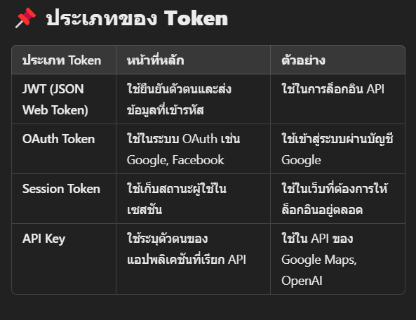

----------Server----------
express: เว็บเฟรมเวิร์กสำหรับสร้างเว็บหรือ API.
morgan: แสดงข้อมูลการ request ใน console.
cors: อนุญาตให้แชร์ข้อมูลข้ามโดเมน.
nodemon: รีโหลดเซิร์ฟเวอร์อัตโนมัติเมื่อโค้ดมีการเปลี่ยนแปลง.
bcryptjs: ใช้เข้ารหัสรหัสผ่าน (Hash & Compare Passwords)
jsonwebtoken (JWT): ใช้สร้าง & ตรวจสอบ Token (Authentication & Authorization)

npm init -y ติดตั้ง package.json
npm i express morgan cors nodemon bcryptjs jsonwebtoken ติดตั้ง libary

สร้างไฟล์ server.js
// Initialize the express server
const express = require('express');
const app = express();

// Start the server
app.listen(5000, () => console.log('Server is running on http://localhost:5000'))
Test Command พิมพ์ node server

config package.json เพิ่ม scripts
"start": "nodemon server" ใช้งาน nodemon เพื่อให้ติดตามการเปลี่ยนแปลง
Test Command พิมพ์ npm start ตามสคลิปที่เปลี่ยน

Create the router
app.get('/api', (req, res) => {
res.send('Hello World.');
});

Create middleware and import morgan
app.use(morgan('dev')); // เพื่อแสดงการ request

เทส Postman Get, Post
app.get('/api', (req, res) => {
res.send('Hello World.'); // send the response
});

app.post('/api', (req, res) => {
console.log(req.body); // log the request body ตอนแรกจะยัง undefine เพราะว่า server ยังอ่าน file json ไม่ออก
res.send('Hello World.'); // send the response
});

// middlewere
app.use(express.json()); // parse the request body เพิ่มให้สามารถอ่านเนื่อหาได้

----------Routes----------
สร้างไฟล์ auth.js
// import
const express = require('express');
const router = express.Router();

router.get('/register', (req, res) => {
res.send('Register');
});

module.exports = router // export the router

สร้างไฟล์ category.js
// import express
const express = require('express');
const router = express.Router();

router.get('/category', (req, res) => {
res.send('Category');
});

module.exports = router

กลับมา import ที่ไฟล์ server.js
const { readdirSync } = require('fs'); เพื่ออ่าน dir ตาม path ทีกำหนด

เรียกใช้ readdirSync และ map เพื่อใช้ app.use
readdirSync('./routes').map((r)=> app.use('/api', require(`./routes/${r}`)))

----------Controller----------
สร้างโฟลเดอร์ Controller
สร้างไฟล์ auth.js เพื่อ auth.js ในโฟลเดอร์ route

สร้าง function ในไฟล์ auth.js เพื่อส่งไปให้ auth.js ในโฟลเดอร์ route ใช้งาน
exports.register = async (req, res) => {
try {
res.send('Register In Controller');
} catch (err) {
console.log(err);
res.status(500).json({message: 'Server Error'});
}
};

เข้าไป import ใช้งาน
const { register } = require('../controller/auth'); //
router.post('/register', register);

ทำเหมือนเดิมในส่วน category

req.body ส่วนที่ยิงจาก postman
req.params ส่วนหัว path http

เทส Get Post Delete เสร็จ

----------File Auth Controller------------
ทำส่วน Register ทำเงื่อนไงต่างๆ

exports.register = async (req, res) => {
try {
const { email, password } = req.body; // Destructure email and password from req.body

    // Check if email is provided
    if (!email) {
        return res.status(400).json({ message: "Please provide email"});
    };

    // Check if password is provided
    if (!password) {
        return res.status(400).json({ message: "Please provide password"});
    };

    // check email in database

    console.log(email, password);
    res.send("Register In Controller");

} catch (err) {
console.log(err);
res.status(500).json({ message: "Server Error" });
}
};

------------ติดตั้ง Prisma ---------
npm i prisma = ติดตั้ง Prisma CLI 🛠️ ใช้สำหรับจัดการฐานข้อมูล เช่น
สร้างไฟล์ schema
รัน migration
สร้าง client สำหรับเชื่อมต่อกับฐานข้อมูล

npx prisma init = ตั้งค่าโปรเจกต์ Prisma 🏗️
สร้างโฟลเดอร์ prisma/ และไฟล์ schema.prisma
สร้างไฟล์ .env สำหรับกำหนด DATABASE_URL
พร้อมใช้งาน Prisma กับฐานข้อมูล

npm i @prisma/client = ติดตั้งไลบรารีใช้เชื่อมต่อกับฐานข้อมูล

----------Prisma------------
ทำ Modle ในไฟล์ Prisma
ทำการเชื่อม model เข้าด้วยกัน
เทส การ post data เข้า db ไฟล์ auth.js ส่วน register

jwt.sign(payload, process.env.SECRET, { expiresIn: "1d" }, (err, token) => {
if (err) {
return res.status(500).json({ message: "Server Error" });
}
res.json({ payload, token });
});

jwt.sign = ตัวที่ 1 ใส่ object ตัวที่ 2 ใส่ secretkey ตัวที่ 3 ใส่ expiresIn ทำหน้าที่กำหนดอายุ token ตัวที่ 4 ทำ fuction err

🔐 Token คืออะไร?
Token เป็นข้อมูลชิ้นหนึ่งที่ใช้เพื่อยืนยันตัวตน (Authentication) และกำหนดสิทธิ์ (Authorization) ของผู้ใช้ในระบบ API หรือเว็บแอป โดยปกติจะใช้เพื่อความปลอดภัยในการสื่อสารระหว่าง Client และ Server

📌 JWT (JSON Web Token) คืออะไร?
หนึ่งใน Token ที่นิยมใช้มากที่สุดคือ JWT (JSON Web Token)
ตัว JWT มี 3 ส่วน หลัก:

Header – ระบุประเภทของ Token และอัลกอริธึมที่ใช้เข้ารหัส
Payload – ข้อมูลที่เก็บไว้ เช่น user ID, role, expire time
Signature – ใช้ยืนยันว่า Token ถูกต้อง
